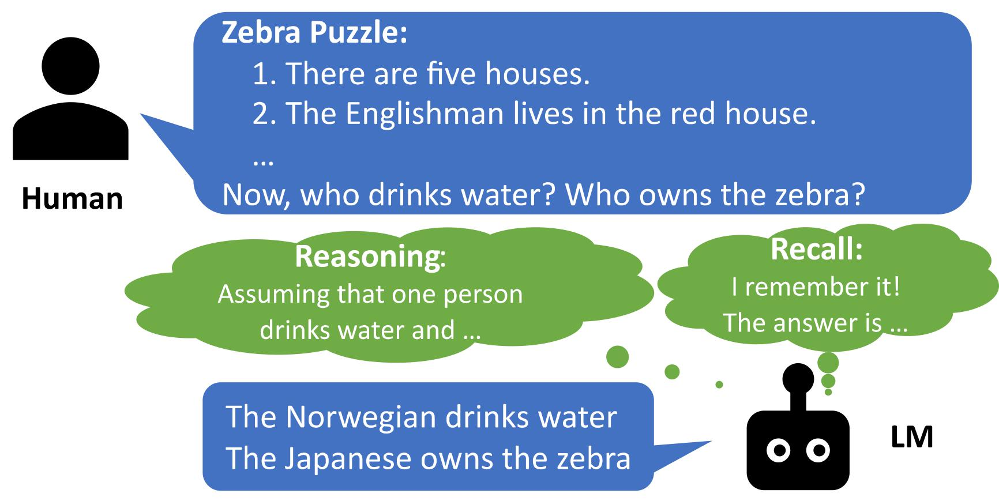
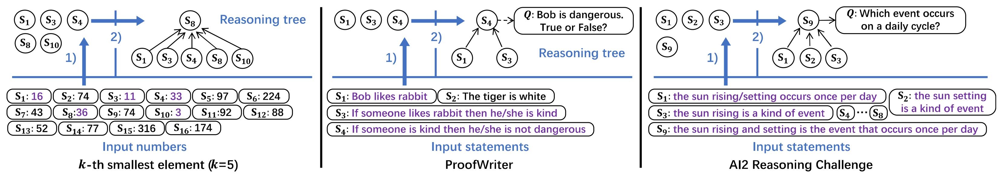

# MechanisticProbe

[]()
[](https://arxiv.org/abs/2310.14491)
[](https://huggingface.co/datasets/yyyyifan/MechanisticProbe_ProofWriter_ARC)
[](https://github.com/yifan-h/MechanisticProbe)


##### Source code for **[Towards a Mechanistic Interpretation of Multi-Step Reasoning Capabilities of Language Models](https://arxiv.org/abs/2310.14491)**


---



> In this paper, we explored how language models (LMs) perform multi-step reasoning tasks: by **memorizing answers from massive pretraining corpus**, or by **step-by-step reasoning**.


---


> To answer the research question, we propose the **MechanisticProbe** to detect the reasoning trees inside LMs via the attention patterns. We run the analysis experiments on three reasoning tasks:
>  1. Probe GPT-2 on the synthetic task: finding the k-th smallest number from a number list;
>  2. Probe LLaMA on the synthetic task: ProofWriter;
>  3. Probe LLaMA on the real-world reasoning task: AI2 Reasoning Challenge (ARC).

> The **MechanisticProbe** is quite simple composed of two **kNN classifiers**: 
>> The first one is used to predict if the statement is useful or not for the reasoning task; 
>> The second one is used to detect the reasoning step of the useful statement.

---

## Try MechanisticProbe

### 1. Prepare the environment

Install necessary libraries:

    $ pip install -r requirements.txt

Download the processed dataset folder from the [HuggingFace repo](https://huggingface.co/datasets/yyyyifan/MechanisticProbe_ProofWriter_ARC).


### 2. Prepare the model

Run the finetuning script to finetune GPT-2 on the synthetic reasoning task (finding the k-th smallest number) by:

    $ bash run_finetune_gpt2.sh

### 3. Run the MechanisticProbe

Run our probe model to analyze the finetuned GPT-2 on the synthetic task:

    $ bash run_probing_gpt2.sh

## Other analysis experiments

We have also prepared code for other analysis experiments. Users have to prepare the datasets as well as the LMS. The path of datasets and models should be specified in the scripts.

> 1. Attention visualization for GPT-2 model on the synthetic reasoning task (*run_attnvisual_gpt2.sh*); 

> 2. Causal analysis (head entropy calculation) and full attention visualization (*run_causal_gpt2.sh*);

> 3. Probing experiments for LLaMA on the ProofWriter and ARC (*run_probing_proofwriter.sh* and *run_probing_arc.sh*);

> 4. Robustness experiment for LLaMA on the ProofWriter (*run_corrupt_proofwriter.sh*).

---

### Cite

If this work/code is helpful for you, welcome to cite our paper:

```
@article{hou2023towards,
  title={Towards a Mechanistic Interpretation of Multi-Step Reasoning Capabilities of Language Models},
  author={Hou, Yifan and Li, Jiaoda and Fei, Yu and Stolfo, Alessandro and Zhou, Wangchunshu and Zeng, Guangtao and Bosselut, Antoine and Sachan, Mrinmaya},
  journal={arXiv preprint arXiv:2310.14491},
  year={2023}
}
```
---

### Contact

Feel free to open an issue or send me (yifan.hou@inf.ethz.ch) an email if you have any questions!
